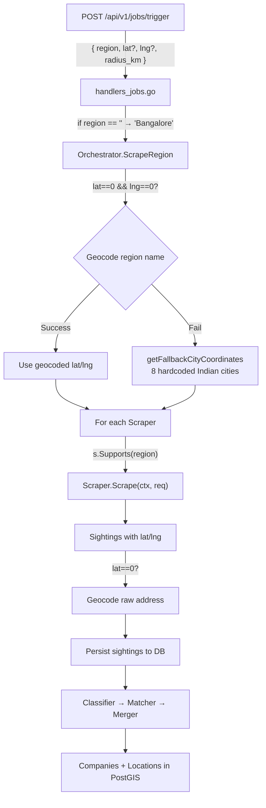
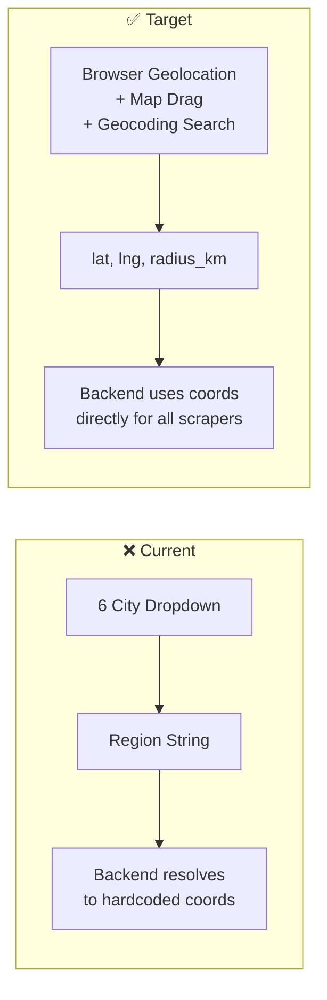
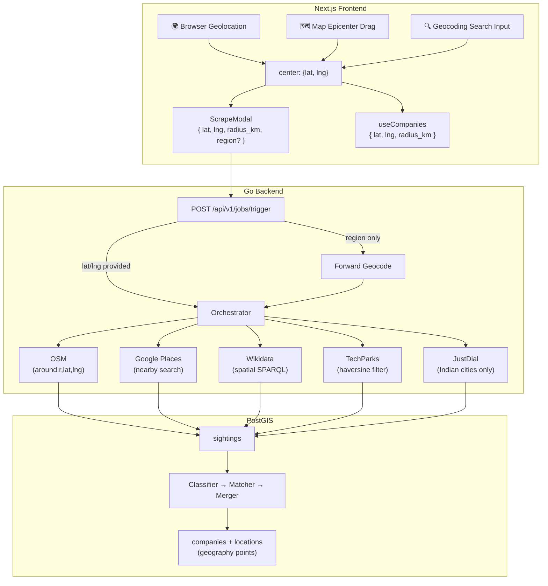

# NearHive — Architecture & Correctness Audit

**Date**: 2026-09-26  
**Scope**: Full-stack audit — Go backend + Next.js frontend  
**Primary Goal**: Enable scraping from the user's current / arbitrary location instead of static city presets  

---

## Executive Summary

NearHive's architecture is **city-name-centric with partial spatial capabilities grafted on**. The PostGIS storage layer and search endpoints operate cleanly on `lat`/`lng` + radius, but the **scraping ingestion pipeline** is tightly coupled to hardcoded Indian city names.

The frontend compounds this by **never sending coordinates to the scraper** — it only sends a city string from a 6-option dropdown, despite the backend already accepting `lat`/`lng` parameters.

### Critical Findings at a Glance

| # | Severity | Finding | Impact |
|---|----------|---------|--------|
| 1 | 🔴 Critical | `ScrapeModal` drops coordinates — only sends city name string | Users cannot scrape their actual location |
| 2 | 🔴 Critical | `useCompany()` type mismatch — expects `Company`, backend returns `{ company, locations }` | Company detail drawer shows `undefined` for all fields |
| 3 | 🔴 Critical | Empty region defaults to `"Bangalore"` — corrupts coordinate-based scrapes | Mixing SF + Bangalore data in same job |
| 4 | 🟠 High | API client reads `errorData.message` but backend sends `errorData.error` | All error messages swallowed |
| 5 | 🟠 High | No `UNIQUE` constraint on `companies.normalized_name` — concurrent scrapers create duplicates | Duplicate company records |
| 6 | 🟠 High | Wikidata/TechPark/JustDial ignore `lat`/`lng` entirely | 3 of 5 scrapers don't support dynamic locations |
| 7 | 🟡 Medium | `queryClient.invalidateQueries()` inside `queryFn` — TanStack anti-pattern | Cascading refetch loops on window focus |
| 8 | 🟡 Medium | No search input debounce — PostGIS hammered on every keystroke | Performance degradation |
| 9 | 🟡 Medium | Missing rate limiter for Wikidata SPARQL | Risk of IP ban from Wikimedia |
| 10 | 🟡 Medium | Dead cron schedule — `SCRAPE_SCHEDULE` env var is loaded but never used | Scheduled scraping broken |

---

## Part 1: Backend Scraping Pipeline

### Current Data Flow



### Source-by-Source Location Support

| Source | Uses `lat`/`lng`? | Uses `region` string? | Dynamic Location Ready? |
|--------|:---:|:---:|:---:|
| **OSM** (Overpass) | ✅ `around:radius,lat,lng` | ❌ | ✅ Yes |
| **Google Places** | ✅ Nearby Search API | ❌ | ✅ Yes |
| **Wikidata** (SPARQL) | ❌ Completely ignored | ✅ Hardcoded QID map for 10 cities | ❌ No |
| **TechParks** (YAML) | ❌ Completely ignored | ✅ `strings.EqualFold(park.Region)` | ❌ No |
| **JustDial** (scraper) | ❌ Completely ignored | ✅ URL path: `/region/Software-Companies` | ❌ No |

> [!IMPORTANT]
> Only 2 of 5 scrapers (OSM + Google Places) can work with arbitrary coordinates. The other 3 are locked to hardcoded city names.

### Hardcoded Coordinate Maps

**1. Fallback city coordinates** — [`internal/scraper/orchestrator.go:212-233`](file:///Users/sonukumar/project/nearhive/internal/scraper/orchestrator.go#L212-L233):
```text
Bangalore/Bengaluru → (12.9716, 77.5946)
Hyderabad/Cyberabad → (17.3850, 78.4867)
Pune               → (18.5204, 73.8567)
Chennai/Madras      → (13.0827, 80.2707)
Gurgaon/Gurugram    → (28.4595, 77.0266)
Noida               → (28.5355, 77.3910)
Mumbai/Bombay       → (19.0760, 72.8777)
Delhi/New Delhi     → (28.6139, 77.2090)
```

**2. Wikidata QID map** — [`internal/scraper/sources/wikidata.go:19-30`](file:///Users/sonukumar/project/nearhive/internal/scraper/sources/wikidata.go#L19-L30):
8 Indian cities mapped to Wikidata entity IDs.

**3. Tech parks YAML** — [`config/techparks.yaml`](file:///Users/sonukumar/project/nearhive/config/techparks.yaml):
14 tech parks across 6 cities with hardcoded coordinates and static tenant lists.

**4. Seed data** — [`internal/store/seed.go:41-60`](file:///Users/sonukumar/project/nearhive/internal/store/seed.go#L41-L60):
15 hardcoded company locations for Bangalore, Hyderabad, Pune.

---

## Part 2: Backend Bugs & Architectural Gaps

### Bug 1: Empty Region Defaults to "Bangalore" — Corrupts Coordinate Scrapes

In [`internal/api/handlers_jobs.go:47-49`](file:///Users/sonukumar/project/nearhive/internal/api/handlers_jobs.go#L47-L49):
```go
if req.Region == "" {
    req.Region = "Bangalore"
}
```

If a client sends `{"lat": 37.77, "lng": -122.42}` (San Francisco) without `region`:
- OSM + Google scrape **San Francisco** (they use lat/lng) ✅
- Wikidata + TechPark + JustDial see `region = "Bangalore"` and scrape **Bangalore** ❌
- Result: A single job mixes companies from two continents into the same database.

### Bug 2: Wikidata Centroid Stacking

Most Wikidata entities lack precise coordinates (`wdt:P625`). When `Lat == 0`, the orchestrator geocodes `"Bangalore, India"` → the exact city center. **Dozens of companies get stacked at the same pixel** on the map at `(12.9716, 77.5946)`.

### Bug 3: OSM Null Island Query

If geocoding fails and fallback fails, `lat=0, lng=0` reaches OSM. The Overpass query runs against `(around:15000, 0.0, 0.0)` — the Gulf of Guinea / Null Island in the Atlantic Ocean.

### Bug 4: `Scraper.Supports(region string)` Cannot Evaluate Coordinates

The interface signature only takes a string:
```go
type Scraper interface {
    Name() string
    Supports(region string) bool
    Scrape(ctx context.Context, req ScrapeRequest) (*ScrapeResult, error)
}
```
Sources like TechPark and Wikidata have no way to evaluate whether they can serve arbitrary `lat`/`lng` coordinates.

### Bug 5: Dead Cron Schedule

`SCRAPE_SCHEDULE` env var is loaded into config, but [`cmd/nearhive/main.go:98`](file:///Users/sonukumar/project/nearhive/cmd/nearhive/main.go#L98) uses a hardcoded `24*time.Hour` ticker, ignoring the cron expression entirely.

### Bug 6: Missing Wikidata Rate Limiter

[`internal/scraper/ratelimit.go:16-21`](file:///Users/sonukumar/project/nearhive/internal/scraper/ratelimit.go#L16-L21) defines rate limiters for `osm`, `techpark`, `google`, `justdial` — but **not `wikidata`**. SPARQL requests run unlimited, risking HTTP 429 bans from Wikimedia.

### Bug 7: Race Condition → Duplicate Companies

No `UNIQUE` constraint on `companies.normalized_name` or `companies.domain`. When concurrent workers process the same company, both find no match and both call `CreateCompany`, producing duplicate records.

### Bug 8: Silently Swallowed Errors

| Location | Issue |
|----------|-------|
| [`internal/api/handlers_jobs.go:46`](file:///Users/sonukumar/project/nearhive/internal/api/handlers_jobs.go#L46) | `_ = json.NewDecoder(r.Body).Decode(&req)` — malformed JSON silently defaults to Bangalore |
| [`internal/api/handlers_jobs.go:61`](file:///Users/sonukumar/project/nearhive/internal/api/handlers_jobs.go#L61) | `_ = h.store.CreateJob(...)` — DB write failure ignored, job ID returned for nonexistent row |
| [`internal/api/handlers_search.go:74`](file:///Users/sonukumar/project/nearhive/internal/api/handlers_search.go#L74) | `total, _ := h.store.CountSearch(...)` — count error swallowed, returns `total: 0` |

### Bug 9: No Coordinate Validation

Neither `Search`, `SearchClusters`, nor `TriggerJob` validate `lat ∈ [-90, 90]` or `lng ∈ [-180, 180]`.

### Bug 10: Missing Database Indexes

| Table | Missing Index | Affected Query |
|-------|--------------|----------------|
| `scrape_jobs` | `created_at`, `status` | `ListJobs ORDER BY created_at DESC` |
| `sightings` | `scraped_at` | `GetSightingsByCompany ORDER BY scraped_at DESC` |
| `companies` | GIN trigram on `name`, `industry` | `Search` uses `ILIKE` → sequential scan |

---

## Part 3: Frontend Bugs & UX Gaps

### Bug 1: ScrapeModal Drops Coordinates (The Core Limitation)

[`web/src/components/drawers/ScrapeModal.tsx:30-33`](file:///Users/sonukumar/project/nearhive/web/src/components/drawers/ScrapeModal.tsx#L30-L33):
```ts
const res = await triggerMutation.mutateAsync({ region, radius_km: radiusKm });
```

It **only sends `region` and `radius_km`**. The `lat` and `lng` fields — which `useTriggerScraper` and the Go backend both accept — are **never populated**. Even if the user drags the map epicenter to Mumbai, the scraper always fires against whatever city name is in the `<select>` dropdown.

### Bug 2: `useCompany()` Type Mismatch (Broken Drawer)

[`web/src/hooks/useCompanyDetails.ts`](file:///Users/sonukumar/project/nearhive/web/src/hooks/useCompanyDetails.ts):
```ts
fetchApi<Company>(`/api/v1/companies/${companyId}`)
```

Backend returns `{ company: { ... }, locations: [...] }`, but the hook expects a flat `Company`. In `CompanyDetailDrawer`, `details?.industry` and `details?.domain` are always `undefined`. The `locations` array is completely lost.

### Bug 3: API Error Messages Swallowed

[`web/src/lib/api-client.ts:23-27`](file:///Users/sonukumar/project/nearhive/web/src/lib/api-client.ts#L23-L27):
```ts
throw new ApiError(res.status, errorData.code || 'API_ERROR', errorData.message || res.statusText);
```

Backend sends `{ "error": "invalid company id" }` but frontend reads `errorData.message` (which doesn't exist). Every error falls back to `res.statusText` — users see "Bad Request" instead of the actual error.

### Bug 4: TanStack Query Side Effect in `queryFn`

[`web/src/hooks/useScrapeJobs.ts:12-15`](file:///Users/sonukumar/project/nearhive/web/src/hooks/useScrapeJobs.ts#L12-L15):
```ts
// Inside queryFn:
if (job.status === 'done' || job.status === 'cancelled') {
    queryClient.invalidateQueries({ queryKey: ['companies'] });
    queryClient.invalidateQueries({ queryKey: ['clusters'] });
}
```

`invalidateQueries` inside `queryFn` fires on every background refetch, window refocus, and cache read when the job is terminal — causing cascading refetch loops.

### Bug 5: Auth Race Condition

`useAuth` initializes token asynchronously in `useEffect`. `useCompanies` fires immediately on mount. The initial search request goes out unauthenticated before the guest token is available. Additionally, expired JWTs in `localStorage` are never detected or cleared.

### Bug 6: No Search Debounce

`searchQuery` in `Sidebar` is wired directly to `setSearchQuery`. Every keystroke triggers a PostGIS spatial query. Similarly, epicenter dragging with 14-decimal-place precision floods the API.

### Bug 7: Leaflet Stale Closures & Memory Leaks

- Epicenter drag callback closes over the initial `onCenterChange` ref (empty dep array `[]`)
- Company pin click handlers reference `onSelectCompany` not in the dependency array
- `epicenterRef`, `circleRef`, `markerLayerRef` never nulled on cleanup
- React StrictMode double-mount can cause "Map container already initialized"

### Bug 8: `select-none` on Root Container

[`web/src/app/page.tsx:63`](file:///Users/sonukumar/project/nearhive/web/src/app/page.tsx#L63) sets `select-none` on the entire app. Users **cannot select or copy** any text — company names, addresses, coordinates, or domains.

---

## Part 4: Improvement Plan — Dynamic Location Scraping

### The Goal

> Users should be able to scrape tech companies from **their current browser location** or **any arbitrary point on the map**, not just 6 hardcoded Indian cities.

### Current State vs Target State



### Implementation: Backend Changes

#### 4.1 — Fix the Region Default ([`internal/api/handlers_jobs.go`](file:///Users/sonukumar/project/nearhive/internal/api/handlers_jobs.go))

**Replace** the Bangalore default with reverse geocoding:
```go
// BEFORE:
if req.Region == "" { req.Region = "Bangalore" }

// AFTER:
if req.Region == "" && req.Lat != 0 && req.Lng != 0 {
    // Reverse geocode to get a human-readable region label
    loc, err := geocoder.ReverseGeocode(ctx, req.Lat, req.Lng)
    if err == nil && loc != nil {
        req.Region = loc.City // e.g. "San Francisco"
    } else {
        req.Region = fmt.Sprintf("%.3f, %.3f", req.Lat, req.Lng)
    }
} else if req.Region == "" {
    http.Error(w, "region or lat/lng required", http.StatusBadRequest)
    return
}
```

#### 4.2 — Modernize Scraper Interface

```go
// BEFORE:
type Scraper interface {
    Name() string
    Supports(region string) bool
    Scrape(ctx context.Context, req ScrapeRequest) (*ScrapeResult, error)
}

// AFTER:
type Scraper interface {
    Name() string
    Supports(req ScrapeRequest) bool  // Full request, not just string
    Scrape(ctx context.Context, req ScrapeRequest) (*ScrapeResult, error)
}
```

This allows each scraper to decide support based on coordinates + region + radius, not just a city name.

#### 4.3 — Upgrade Individual Scrapers

| Scraper | Change |
|---------|--------|
| **OSM** | Add guard: abort if `lat == 0 && lng == 0` to prevent Null Island queries |
| **Google** | Already works with lat/lng — verify key and radius |
| **Wikidata** | Replace hardcoded QID map with `SERVICE wikibase:around` spatial SPARQL query (searches by radius around any coordinate). Falls back to QID map if lat/lng unavailable |
| **TechPark** | Replace `strings.EqualFold(park.Region)` with Haversine distance check: include any park within `req.RadiusKM` of `(req.Lat, req.Lng)` |
| **JustDial** | Make `Supports()` return `false` for non-Indian coordinates. Use reverse-geocoded city name for Indian locations |

#### 4.4 — Add Input Validation

```go
func validateCoordinates(lat, lng float64) error {
    if lat < -90 || lat > 90 { return fmt.Errorf("lat must be between -90 and 90") }
    if lng < -180 || lng > 180 { return fmt.Errorf("lng must be between -180 and 180") }
    return nil
}
```

#### 4.5 — Add Missing Database Indexes

```sql
CREATE INDEX idx_scrape_jobs_created_at ON scrape_jobs(created_at DESC);
CREATE INDEX idx_scrape_jobs_status ON scrape_jobs(status);
CREATE INDEX idx_sightings_scraped_at ON sightings(scraped_at DESC);
CREATE INDEX idx_companies_name_trgm ON companies USING GIN (name gin_trgm_ops);
```

#### 4.6 — Add Wikidata Rate Limiter

Add `"wikidata"` to the rate limiter registry with a conservative `1 req/2s` bucket.

#### 4.7 — Add Company Uniqueness Constraint

```sql
CREATE UNIQUE INDEX idx_companies_normalized_name ON companies(normalized_name)
    WHERE normalized_name IS NOT NULL;
```

---

### Implementation: Frontend Changes

#### 4.8 — Create `useGeolocation` Hook

```ts
// web/src/hooks/useGeolocation.ts
import { useState, useCallback } from 'react';

export function useGeolocation() {
  const [loading, setLoading] = useState(false);
  const [error, setError] = useState<string | null>(null);

  const locate = useCallback((): Promise<{ lat: number; lng: number }> => {
    return new Promise((resolve, reject) => {
      if (!navigator.geolocation) {
        setError('Geolocation not supported');
        return reject(new Error('Geolocation not supported'));
      }
      setLoading(true);
      navigator.geolocation.getCurrentPosition(
        (pos) => { setLoading(false); resolve({ lat: pos.coords.latitude, lng: pos.coords.longitude }); },
        (err) => { setLoading(false); setError(err.message); reject(err); },
        { enableHighAccuracy: true, timeout: 10000 }
      );
    });
  }, []);

  return { locate, loading, error };
}
```

#### 4.9 — Add "Locate Me" Button to Header

A `<LocateFixed />` icon button in the header that calls `navigator.geolocation` and recenters the map + updates the scrape target.

#### 4.10 — Upgrade ScrapeModal to Pass Coordinates

Support toggling between "Current Map Location (Coordinates)" and "Preset Tech Hub".
When "Current Map Location" is active, send:
```ts
await triggerMutation.mutateAsync({
  region: `Custom (${currentCenter.lat.toFixed(3)}, ${currentCenter.lng.toFixed(3)})`,
  lat: currentCenter.lat,
  lng: currentCenter.lng,
  radius_km: radiusKm,
});
```

#### 4.11 — Fix `useCompany` Type Mismatch

```ts
// In web/src/types/index.ts:
export interface CompanyDetailResponse {
  company: Company;
  locations: Location[];
}

// In web/src/hooks/useCompanyDetails.ts:
fetchApi<CompanyDetailResponse>(`/api/v1/companies/${companyId}`)
```

#### 4.12 — Fix API Error Parsing

```ts
// web/src/lib/api-client.ts:
throw new ApiError(res.status, errorData.code || 'API_ERROR', errorData.error || errorData.message || res.statusText);
```

#### 4.13 — Move Query Invalidation Out of `queryFn`

```ts
// Use useEffect or onSuccess instead of inline in queryFn:
const { data: job } = useScrapeJob(jobId);
useEffect(() => {
  if (job?.status === 'done' || job?.status === 'cancelled') {
    queryClient.invalidateQueries({ queryKey: ['companies'] });
    queryClient.invalidateQueries({ queryKey: ['clusters'] });
  }
}, [job?.status]);
```

#### 4.14 — Add Search Debounce

```ts
const [rawQuery, setRawQuery] = useState('');
const debouncedQuery = useDebounce(rawQuery, 300); // 300ms debounce
```

---

## Part 5: Prioritized Action Items

### Phase 1 — Critical Bug Fixes (Correctness)

| # | Status | Task | Files | Effort |
|---|:------:|------|-------|--------|
| 1 | [x] | Fix `useCompany` type mismatch + drawer | `useCompanyDetails.ts`, `CompanyDetailDrawer.tsx` | S |
| 2 | [x] | Fix API error field (`error` not `message`) | `api-client.ts` | XS |
| 3 | [x] | Fix region default — don't force "Bangalore" | `handlers_jobs.go` | S |
| 4 | [x] | Fix TanStack `queryFn` side effect | `useScrapeJobs.ts` | S |
| 5 | [x] | Fix JSON decode error swallowing | `handlers_jobs.go` | XS |
| 6 | [x] | Add coordinate validation | `handlers_jobs.go`, `handlers_search.go` | S |

### Phase 2 — Dynamic Location (Primary Goal)

| # | Status | Task | Files | Effort |
|---|:------:|------|-------|--------|
| 7 | [x] | Create `useGeolocation` hook | `web/src/hooks/useGeolocation.ts` | S |
| 8 | [x] | Add "Locate Me" button to header | `web/src/app/page.tsx` | S |
| 9 | [x] | Pass `center` + `radiusKm` to ScrapeModal | `page.tsx`, `ScrapeModal.tsx` | M |
| 10 | [x] | Upgrade ScrapeModal — mode toggle + send lat/lng | `ScrapeModal.tsx` | M |
| 11 | [x] | Refactor `Scraper.Supports(string)` → `Supports(ScrapeRequest)` | All scrapers + orchestrator | M |
| 12 | [x] | Upgrade Wikidata to spatial SPARQL | `sources/wikidata.go` | M |
| 13 | [x] | Upgrade TechPark to Haversine distance | `sources/techpark.go` | S |
| 14 | [x] | Guard OSM against Null Island | `sources/osm.go` | XS |
| 15 | [x] | Make JustDial skip non-Indian coordinates | `sources/justdial.go` | XS |
| 16 | [x] | Add reverse geocoding for label when only lat/lng provided | `orchestrator.go` | S |

### Phase 3 — Performance & Robustness

| # | Status | Task | Files | Effort |
|---|:------:|------|-------|--------|
| 17 | [x] | Add search debounce (300ms) | `page.tsx` | XS |
| 18 | [x] | Add missing DB indexes | `migrations/000009_*.sql` | S |
| 19 | [x] | Add `UNIQUE` constraint on `companies.normalized_name` | `migrations/000009_*.sql`, `merger.go` | S |
| 20 | [x] | Add Wikidata rate limiter | `ratelimit.go` | XS |
| 21 | [x] | Fix auth token expiry detection + 401 retry/eviction | `api-client.ts` | M |
| 22 | [x] | Fix Leaflet stale closures + cleanup + map click | `ClientMap.tsx` | M |
| 23 | [x] | Remove `select-none` from root container | `page.tsx` | XS |
| 24 | [x] | Clean interval scheduler / background crawling | `main.go`, `scheduler` | S |

> [!TIP]
> **Quick wins** (XS effort, high impact): Items 2, 14, 15, 17, 20, 23 can all be implemented in under 30 minutes total.

---

## Target Architecture


