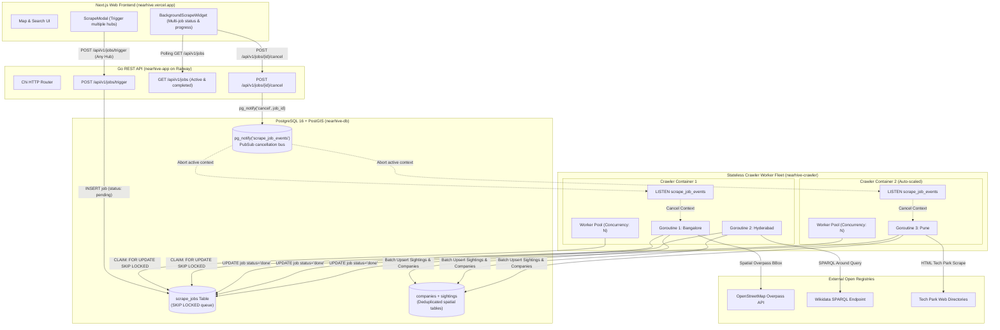

# Stateless Concurrent Crawler & Multi-Scrape Architecture Plan

> **For agentic workers:** REQUIRED SUB-SKILL: Use superpowers:subagent-driven-development (recommended) or superpowers:executing-plans to implement this plan task-by-task. Steps use checkbox (`- [ ]`) syntax for tracking.

**Goal:** Transform NearHive's web crawler into a fully stateless, horizontally scalable scraping daemon with a concurrent worker pool, and update the Next.js UI to support dispatching and monitoring multiple scraping jobs simultaneously.

**Architecture:** 
- **Stateless Daemon**: The crawler maintains zero local state on disk or in memory between runs; all job coordination, data storage, and cancellations are brokered via PostgreSQL (`FOR UPDATE SKIP LOCKED` + `LISTEN/NOTIFY`).
- **Concurrent Worker Pool**: The crawler daemon runs `N` concurrent worker goroutines (configurable via `CRAWLER_CONCURRENCY`, default 3) to process multiple scraping requests in parallel without blocking each other.
- **Multi-Job Frontend State**: Next.js state transitions from a single `activeJobId: string | null` to an array `activeJobIds: string[]`, enabling users to trigger multiple hub scrapes without UI lockouts, monitored via an expandable multi-job widget.

**Tech Stack:** Go 1.23, PostgreSQL 16 (PostGIS), pgxpool, Next.js 15, TanStack Query, Tailwind CSS, Docker.

---

## 🏗️ Updated Architecture Diagram

---

## 📋 Implementation Tasks

### Task 1: Crawler Concurrency Worker Pool (Backend)
**Files:**
- Modify: [`internal/crawler/worker.go`](file:///Users/sonukumar/project/nearhive/internal/crawler/worker.go)
- Modify: [`internal/config/config.go`](file:///Users/sonukumar/project/nearhive/internal/config/config.go)

**Changes:**
- Add `Concurrency int` (default 3) to `WorkerConfig` and `CRAWLER_CONCURRENCY` env var.
- Replace single-thread `w.processNextJob(ctx)` with a buffered semaphore channel (`make(chan struct{}, w.cfg.Concurrency)`).
- When a job is dequeued, launch a goroutine while occupying a semaphore slot.
- Ensure graceful drain on shutdown (`w.wg.Wait()`).

---

### Task 2: Active Jobs List Query Endpoint & Polish (Backend)
**Files:**
- Modify: [`internal/store/postgres/jobs.go`](file:///Users/sonukumar/project/nearhive/internal/store/postgres/jobs.go)
- Modify: [`internal/api/handlers_jobs.go`](file:///Users/sonukumar/project/nearhive/internal/api/handlers_jobs.go)

**Changes:**
- Ensure `GET /api/v1/jobs` supports filtering by `status=active` (pending + running).
- Return jobs ordered by `created_at DESC` with subtasks attached so clients can poll all active jobs in a single request.

---

### Task 3: Multi-Job Triggering & UI State (Frontend)
**Files:**
- Modify: [`web/src/app/page.tsx`](file:///Users/sonukumar/project/nearhive/web/src/app/page.tsx)
- Modify: [`web/src/components/drawers/ScrapeModal.tsx`](file:///Users/sonukumar/project/nearhive/web/src/components/drawers/ScrapeModal.tsx)

**Changes:**
- Change `activeJobId: string | null` to `activeJobIds: string[]`.
- In `ScrapeModal.tsx`:
  - Do NOT disable inputs or hide the "Start Scraping" button when a scrape is in progress.
  - Allow user to queue multiple jobs (e.g. Bangalore, then Pune, then a custom pin on the map).
  - Show a list of currently queued/running jobs inside the modal with instant cancel buttons.

---

### Task 4: Multi-Job Background Widget (Frontend)
**Files:**
- Modify: [`web/src/components/scrapers/BackgroundScrapeWidget.tsx`](file:///Users/sonukumar/project/nearhive/web/src/components/scrapers/BackgroundScrapeWidget.tsx)
- Modify: [`web/src/hooks/useScrapeJobs.ts`](file:///Users/sonukumar/project/nearhive/web/src/hooks/useScrapeJobs.ts)

**Changes:**
- Support rendering multiple running jobs simultaneously:
  - If 1 job is running: show standard detailed card.
  - If multiple jobs are running: show compact stacked cards or a summary badge with accordion (`3 active scraping pipelines running...`).
  - Provide individual cancel buttons and combined sightings discovery counter.

---

### Task 5: End-to-End Multi-Worker Verification
**Actions:**
- Run Docker Compose with `CRAWLER_CONCURRENCY=3`.
- Dispatch 3 distinct scrapes (Bangalore 15km, Hyderabad 15km, Pune 15km).
- Verify in logs that all 3 run concurrently across goroutines.
- Verify that cancelling 1 job does not interrupt the other 2.
