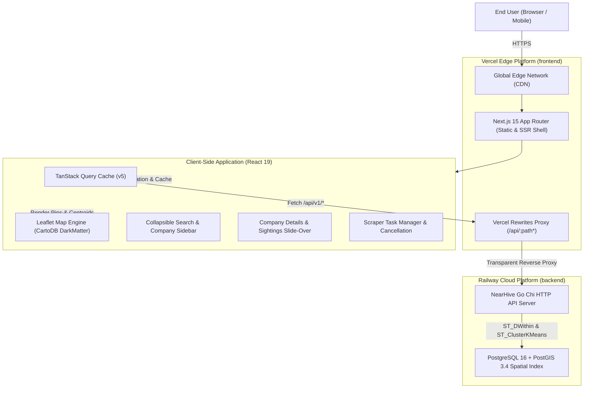

# NearHive React Web Frontend — Architecture & Baseline System Design

**Date:** 2026-09-26  
**Status:** Approved / Spec  
**Target Platform:** Vercel (Edge & Serverless Static CDN)  
**Backend API:** Railway (`https://nearhive-production.up.railway.app`)

---

## 1. Executive Summary & Problem Context

NearHive currently serves an embedded single-file HTML/CSS/JS frontend directly from the Go binary (`internal/web/index.html`). While effective for rapid prototyping and zero-dependency deployments, it introduces significant technical debt and UX constraints as the platform matures:
- **No Component Reusability or Modular State:** UI updates rely on imperative DOM manipulation (`innerHTML`, `getElementById`), leading to brittle view rendering and memory leaks.
- **Manual Polling & State Management:** Background job tracking and search polling require manual `setInterval` management without error recovery, request deduplication, or window-focus refetching.
- **Limited User Interactivity:** Lack of deep-linking, rich company verification breakdown, sightings inspection timeline, and geospatial data export (CSV/GeoJSON).
- **Deployment Coupling:** Serving web assets from the Go binary requires a full Docker rebuild and container restart on Railway for every minor UI change.

### 1.1 Why React & TanStack Query?
1. **Declarative Geospatial State:** Managing a Leaflet map (with draggable epicenter, dynamic radius circle, 1,700+ pins, and cluster centroids) simultaneously with a filterable sidebar and detail drawer requires declarative state management. React ensures that whenever coordinates or radius change, all layers, badges, and cards update synchronously.
2. **TanStack Query (React Query v5):**
   - Eliminates boilerplate data fetching and provides automated query caching and request deduplication.
   - Declarative background polling: Background scrape jobs poll smoothly with `refetchInterval: (query) => query.state.data?.status === 'running' ? 2000 : false`.
   - Automated cache invalidation: Once a scrape job finishes or cancels, it automatically invalidates `['companies']` and `['clusters']`, refreshing map pins seamlessly without full-page reloads.
3. **Component Encapsulation:** Isolates drawers, modals, timeline badges, and cluster pins into maintainable, typed, unit-testable components.

### 1.2 Framework Evaluation: Next.js 15 (App Router) vs. Vite React SPA for Vercel
We evaluated both options specifically under the constraint of **Vercel deployment**:

| Evaluation Criterion | **Next.js 15 (App Router)** *(Selected)* | **Vite React SPA** |
| :--- | :--- | :--- |
| **Vercel Platform Integration** | Native, first-class citizen. Vercel optimizes Next.js builds, Edge caching, and static asset streaming automatically. | Requires manual `vercel.json` routing configuration. |
| **Backend API Proxying** | Native `next.config.ts` rewrites transparently forward `/api/:path*` to Railway (`https://nearhive-production.up.railway.app`), eliminating CORS preflight latency. | Requires Vercel Serverless Function rewrites in `vercel.json`. |
| **Leaflet / SSR Compatibility** | Handled cleanly using `next/dynamic(() => import('./ClientMap'), { ssr: false })` for the map canvas, while maintaining fast static shell rendering. | Native client-only (no SSR issues). |
| **Future SEO & Deep-Linking** | Supports static/dynamic SSR routes (e.g. `/company/[slug]` with OpenGraph tags for rich previews on LinkedIn/Twitter). | Entirely client-side; poor SEO for public company directory pages. |

**Decision:** Next.js 15 (App Router) was selected because it maximizes Vercel's Edge infrastructure, provides clean reverse-proxy rewrites to the Railway backend, and provides a clear path for future SEO-indexable company profile pages while keeping Leaflet safely isolated to dynamic client modules.

---

## 2. High-Level Architecture Diagram



---

## 3. Vercel Deployment Architecture

### 3.1 Subdirectory Monorepo Layout
The React frontend lives in the `web/` directory within the `nearhive` repository:
```
nearhive/
├── cmd/nearhive/          # Go backend entrypoint
├── internal/              # Go core business logic
├── migrations/            # PostGIS database migrations
├── web/                   # Next.js React frontend
│   ├── src/
│   │   ├── app/           # Next.js App Router (layout, page, providers)
│   │   ├── components/    # Reusable UI, Map, Sidebar, Drawers
│   │   ├── hooks/         # TanStack Query & custom hooks
│   │   ├── lib/           # API client, query client, export utils
│   │   └── types/         # TypeScript API contracts
│   ├── public/            # Static assets, marker icons
│   ├── package.json
│   ├── tsconfig.json
│   ├── next.config.ts
│   └── tailwind.config.ts
```

### 3.2 Vercel Configuration & Rewrites (`next.config.ts`)
To eliminate CORS preflight overhead and ensure zero-configuration authentication cookie/header forwarding, Next.js handles reverse proxy rewrites to Railway:

```typescript
// web/next.config.ts
import type { NextConfig } from 'next';

const nextConfig: NextConfig = {
  reactStrictMode: true,
  async rewrites() {
    const backendUrl = process.env.NEXT_PUBLIC_API_URL || 'https://nearhive-production.up.railway.app';
    return [
      {
        source: '/api/:path*',
        destination: `${backendUrl}/api/:path*`,
      },
      {
        source: '/health/:path*',
        destination: `${backendUrl}/health/:path*`,
      },
    ];
  },
};

export default nextConfig;
```

### 3.3 Vercel Project Settings
- **Framework Preset:** Next.js
- **Root Directory:** `web`
- **Build Command:** `pnpm build` (or `npm run build`)
- **Output Directory:** Automatically managed by Next.js (`.next`)
- **Environment Variables:**
  - `NEXT_PUBLIC_API_URL`: `https://nearhive-production.up.railway.app` (production) / `http://localhost:8080` (local development)

---

## 4. State Management & Data Fetching (TanStack Query v5)

TanStack Query manages all server state, background refetching, and cache invalidation.

### 4.1 Query Keys Hierarchy
```typescript
export const queryKeys = {
  companies: {
    all: ['companies'] as const,
    search: (params: SearchParams) => ['companies', 'search', params] as const,
    detail: (id: string) => ['companies', 'detail', id] as const,
    sightings: (id: string) => ['companies', 'sightings', id] as const,
  },
  clusters: {
    all: ['clusters'] as const,
    byRegion: (params: ClusterParams) => ['clusters', params] as const,
  },
  jobs: {
    all: ['jobs'] as const,
    list: (limit: number, offset: number) => ['jobs', 'list', { limit, offset }] as const,
    detail: (id: string) => ['jobs', 'detail', id] as const,
  },
  auth: {
    me: ['auth', 'me'] as const,
  },
};
```

### 4.2 Intelligent Polling & Automatic Invalidation
When a scrape job is triggered:
1. `useScrapeJob(jobId)` uses dynamic polling:
   ```typescript
   refetchInterval: (query) => {
     const status = query.state.data?.status;
     return (status === 'running' || status === 'pending') ? 2000 : false;
   }
   ```
2. When the job transitions to `done` or `cancelled`:
   - Invalidate `queryKeys.companies.all`
   - Invalidate `queryKeys.clusters.all`
   - Invalidate `queryKeys.jobs.list`
   - Map markers and sidebar immediately refresh with the newly indexed tech company offices.

---

## 5. UI/UX Design System: "Tech Hive Sleek"

### 5.1 Color Palette & Visual Hierarchy
- **Base Surfaces:** Deep Obsidian/Slate (`slate-950` `#020617`, `slate-900` `#0f172a`, `slate-800/80` `#1e293b`).
- **Brand Accents:** Radiant Amber (`amber-400` `#fbbf24`, `amber-500` `#f59e0b`, `amber-600` `#d97706`).
- **Verification States:**
  - High Confidence (>= 80%): Emerald (`emerald-400` `#34d399`, `emerald-500/10` background).
  - Moderate Confidence (60-79%): Amber (`amber-400` `#fbbf24`).
  - Low Confidence (< 60%): Slate (`slate-400` `#94a3b8`).
- **Failure / Cancellation:** Rose (`rose-400` `#fb7185`, `rose-500/20` background).
- **Glassmorphism:** `backdrop-blur-md bg-slate-900/90 border border-slate-800/80 shadow-2xl`.

### 5.2 Responsive Layout
- **Desktop (>= 1024px):**
  - Left Sidebar (420px fixed): Search filter, industry pills, confidence slider, company list with virtualized scrolling.
  - Right Canvas (flex-1): Fullscreen interactive Leaflet map, floating epicenter radius slider, floating PostGIS Cluster Mode toggle, and quick city preset chips.
  - Right Slide-over Drawer (480px): Company detail breakdown, sightings timeline, and export modal.
- **Mobile (< 1024px):**
  - Fullscreen map canvas with floating bottom sheet drawer for discovered company cards.
  - Floating action buttons for quick city switching, scraper trigger, and cluster view toggle.

---

## 6. Functional Specifications & Enhancements

### 6.1 Spatial Map & Draggable Epicenter
- **CartoDB DarkMatter Tiles:** High-contrast dark basemap tailored for tech hubs.
- **Draggable Epicenter Pin:** Custom pulsating SVG marker; dragging the pin updates the search centroid (`currentLat`, `currentLng`) and redraws the PostGIS `ST_DWithin` radius boundary circle.
- **Radius Slider:** Dynamically adjusts radius from 1km to 30km with live geodesic circle recalculation.
- **Preset City Switcher:** Instant smooth fly-to for major Indian tech hubs (Bangalore, Hyderabad, Pune, Chennai, Gurgaon, Noida) and browser "Locate Me" GPS geocoding.

### 6.2 Server-Side PostGIS `ST_ClusterKMeans` View
- Toggle between **Individual Company Pins** and **Server-Side Cluster Density**.
- In Cluster Mode, fetches `/api/v1/search/clusters?lat=...&lng=...&radius=...&k=25`.
- Clusters are rendered as glowing amber centroid bubbles with office counts sized logarithmically (`Math.log2(count)`).
- Clicking any cluster centroid displays a tooltip and a 1-click **"Zoom to inspect offices"** button that flies the camera into that cluster at zoom level 15.

### 6.3 Rich Company Details & Multi-Source Sightings Drawer
Clicking any company opens a sleek slide-over drawer:
- **Header:** Company name, normalized slug, domain with external link, industry tag, employee range.
- **Verification Confidence Gauge:** Circular or bar indicator showing algorithm confidence score and PostGIS verified status.
- **Locations List:** All registered office branches within the search area with reverse-geocoded addresses.
- **Sightings Audit Trail:** Chronological timeline showing raw crawler sightings:
  - Source tag (`OpenStreetMap Overpass`, `Wikidata SPARQL`, `Tech Park Directory`, `Local Listings`).
  - Source URL link.
  - Raw extracted address and timestamp.
  - Raw JSON metadata viewer.

### 6.4 Background Scraper Pipeline & Cancellation Modal
- Trigger scrape jobs for any city/radius.
- Real-time subtask breakdown table consuming `ScrapeTask` rows:
  - `osm`: OpenStreetMap Overpass NWR API
  - `wikidata`: Wikidata SPARQL Query Service
  - `techparks`: Tech Park Tenant Scraper
  - `justdial`: Local Directory Listings
- Visual task state icons: `⏳ Pending`, `⟳ Running` (spinner), `✓ Done` (sightings count + latency in ms), `⊘ Cancelled`, `✕ Failed`.
- **Cancel Scrape Button:** Sends `POST /api/v1/jobs/{id}/cancel`, aborting active background TCP connections in Go immediately.

### 6.5 Export Discovered Data (CSV & GeoJSON)
- **Export to CSV:** Generates downloadable CSV including Company Name, Domain, Industry, Address, City, Lat, Lng, Confidence Score, Distance (meters), and Verified status.
- **Export to GeoJSON:** Produces RFC 7946 standard GeoJSON FeatureCollection with Point geometries and company feature properties for GIS applications (QGIS, Mapbox, ArcGIS).

### 6.6 URL State & Deep-Linking
- Synchronizes search parameters with browser URL query string:
  `/?lat=12.9716&lng=77.5946&radius=15&q=fintech&company=550e8400-e29b-41d4-a716-446655440000`
- Enables sharing direct search queries and individual company office locations across team members.

---

## 7. TypeScript Data Types & Contracts

```typescript
// web/src/types/index.ts

export interface Company {
  id: string;
  name: string;
  normalized_name: string;
  domain?: string;
  industry?: string;
  employee_count?: string;
  created_at: string;
  updated_at: string;
}

export interface Location {
  id: string;
  company_id: string;
  label?: string;
  address: string;
  city?: string;
  state?: string;
  country: string;
  pincode?: string;
  lat: float64;
  lng: float64;
  confidence: number;
  verified: boolean;
  created_at: string;
  updated_at: string;
}

export interface CompanySearchResult {
  id: string; // company_id
  name: string;
  domain?: string;
  industry?: string;
  employee_count?: string;
  location_id: string;
  label?: string;
  address: string;
  city?: string;
  lat: number;
  lng: number;
  confidence: number;
  distance_meters: number;
  verified: boolean;
}

export interface SpatialCluster {
  cluster_id: number;
  count: number;
  lat: number;
  lng: number;
}

export interface Sighting {
  id: string;
  source: string;
  source_url?: string;
  company_name: string;
  raw_address: string;
  lat: number;
  lng: number;
  metadata?: Record<string, any>;
  company_id?: string;
  location_id?: string;
  scraped_at: string;
}

export interface ScrapeTask {
  id: string;
  job_id: string;
  source: string;
  status: 'pending' | 'running' | 'done' | 'failed' | 'cancelled';
  sightings: number;
  error?: string;
  duration_ms: number;
  started_at?: string;
  finished_at?: string;
  created_at: string;
}

export interface ScrapeJob {
  id: string;
  source: string;
  status: 'pending' | 'running' | 'done' | 'failed' | 'cancelled';
  region?: string;
  sightings: number;
  error?: string;
  started_at?: string;
  finished_at?: string;
  created_at: string;
  tasks?: ScrapeTask[];
}

export interface User {
  id: string;
  email: string;
  created_at?: string;
}

export interface AuthResponse {
  token: string;
  user: User;
}
```

---

## 8. Verification & Delivery Criteria

1. **Clean Monorepo Build:** `pnpm build` in `web/` produces zero TypeScript errors and zero Next.js route compilation warnings.
2. **Vercel Readiness:** `next.config.ts` rewrites transparently forward `/api/*` requests to Railway, verifiable locally and on Vercel preview environments.
3. **Feature Parity & Beyond:** Supports all existing capabilities (Leaflet map, ST_DWithin radius, PostGIS ST_ClusterKMeans, scraper trigger, cancellation) plus company detail drawers, sightings timelines, and CSV/GeoJSON export.
4. **Resilience & Testing:** All queries wrapped in TanStack Query hooks with error states, skeletons, and retry fallbacks.
