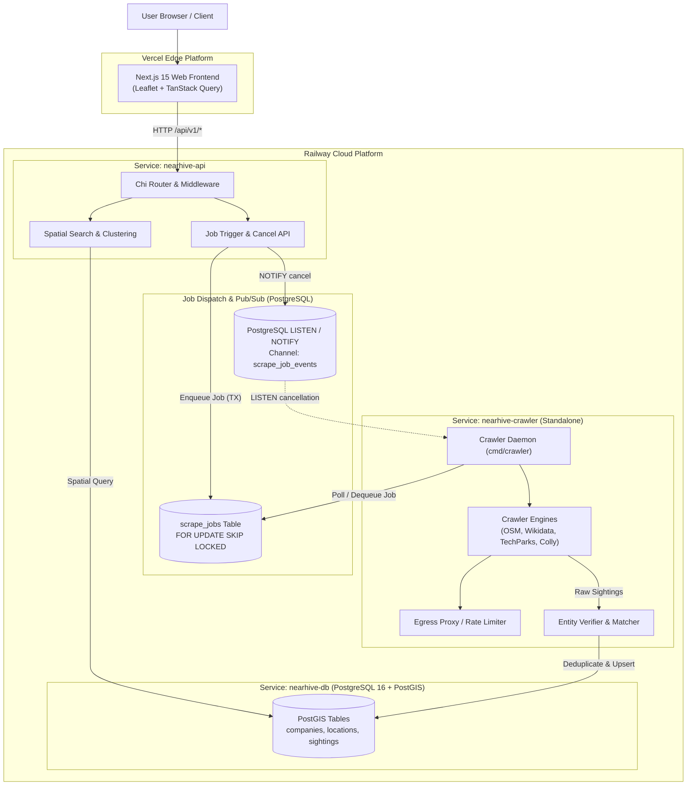
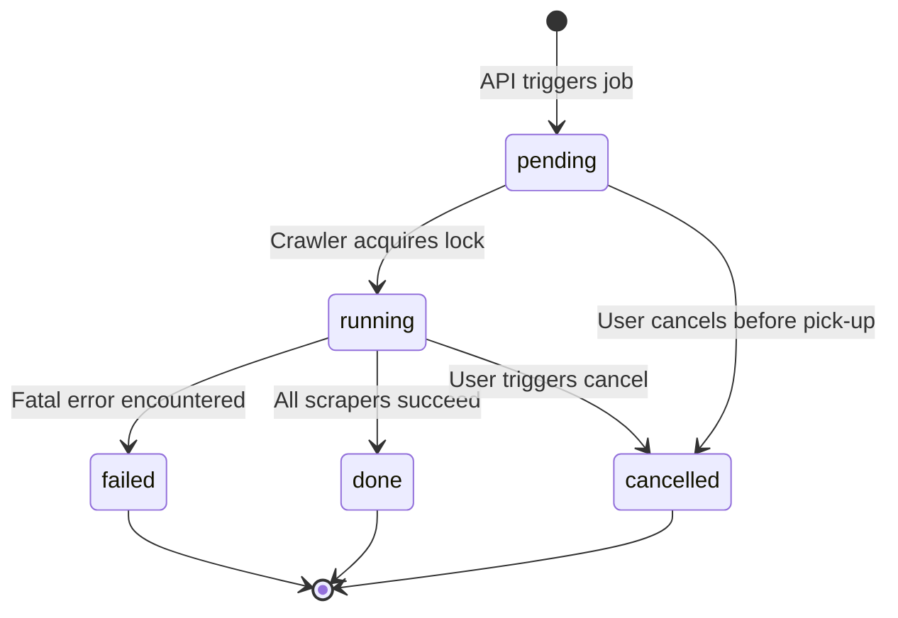
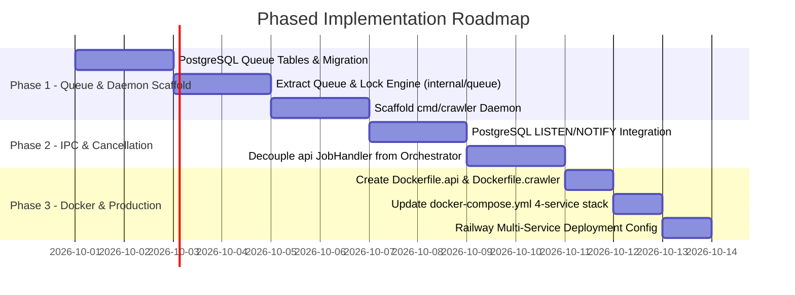

# NearHive — Standalone Crawler Service & Infrastructure Specification

**Date:** 2026-09-26  
**Status:** Approved / Spec  
**Target Architecture:** Decoupled Microservices (API Server + Standalone Crawler Worker + Web Frontend + PostGIS)  
**Deployment Targets:** Railway (API + Crawler + PostGIS) & Vercel (Next.js 15 Web Frontend)  

---

## 1. Executive Summary & Problem Context

NearHive currently runs its scraping pipeline in-process inside the main Go backend binary (`cmd/nearhive`). While effective during initial prototyping, co-locating the scraping runtime inside the HTTP API server creates several architectural bottlenecks as scraping complexity scales:

1. **Coupled Resource Consumption:**
   - Spatial search queries against PostGIS require low-latency CPU and consistent memory (<50ms p95).
   - Crawling and scraping (Overpass API calls, Wikidata SPARQL, HTML DOM parsing via GoQuery, and future Colly link traversals) are bursty, network-heavy, and memory-intensive.
   - A burst in scraper workers directly impacts search response times for active frontend users.

2. **Blast Radius & Crash Isolation:**
   - If an external site times out, returns malformed responses, or triggers an unexpected panic during deep DOM parsing, it should never jeopardize the public search API or user sessions.

3. **Independent Scaling Profiles:**
   - The API server should scale based on HTTP request volume.
   - The crawler worker should scale independently (e.g. 0 replicas when idle, bursting to 5–10 concurrent worker containers during batch crawls or scheduled cron jobs).

4. **Network & Proxy Isolation:**
   - Web crawlers frequently require rotating proxy pools, residential egress IPs, and custom TLS client configurations to avoid IP blacklisting.
   - The core API server should always communicate over direct, high-speed cloud networking without proxy latency.

---

## 2. High-Level Architecture Topology



---

## 3. Core Component Responsibilities

### 3.1 `nearhive-api` (API Server)
- **Role:** Synchronous, low-latency HTTP REST gateway.
- **Key Responsibilities:**
  - JWT Authentication & authorization.
  - Spatial search (`/api/v1/search`), clustering (`/api/v1/search/clusters`), company details.
  - Job management endpoints (`POST /api/v1/jobs/trigger`, `GET /api/v1/jobs/:id`, `POST /api/v1/jobs/:id/cancel`).
  - Enqueues scrape jobs into the job queue inside standard PostgreSQL transactions.
  - Issues cancellation signals via PostgreSQL `NOTIFY scrape_job_events, '{"job_id": "...", "action": "cancel"}'`.
- **Resource Sizing:** 0.5 vCPU, 512MB RAM, always-on (1–2 replicas).

### 3.2 `nearhive-crawler` (Standalone Crawler Daemon)
- **Role:** Asynchronous background processing worker (`cmd/crawler/main.go`).
- **Key Responsibilities:**
  - Polls for pending jobs or listens for notifications.
  - Manages worker pool and token-bucket rate limiters per domain.
  - Executes spatial scrapers (OSM Overpass, Wikidata SPARQL, TechParks, JustDial, and recursive Colly spiders).
  - Listens to PostgreSQL `LISTEN scrape_job_events` for real-time cancellation tokens.
  - Executes entity resolution (`Classifier` → `Matcher` → `Merger` → `GeoVerifier`).
  - Updates `scrape_jobs` and `scrape_tasks` rows with live heartbeats, counts, and status.
- **Resource Sizing:** 1–2 vCPU, 1–2GB RAM, auto-scaled based on queue depth (0–5 replicas).

### 3.3 `nearhive-web` (Web Frontend)
- **Role:** Next.js 15 SPA hosted on Vercel.
- **Interaction:** Unchanged — continues to call `/api/v1/jobs/trigger`, poll `/api/v1/jobs/:id`, and display progress in `BackgroundScrapeWidget`. The service split is 100% transparent to the client.

---

## 4. Inter-Service Communication & Queue Strategy

### 4.1 Queue Evaluation: PostgreSQL vs. Redis

| Criteria | PostgreSQL `FOR UPDATE SKIP LOCKED` *(Selected)* | Redis (Streams / Celery / BullMQ) |
|---|---|---|
| **Infrastructure Overhead** | **Zero** — Uses existing PostgreSQL 16 PostGIS database | Requires running and paying for a Redis instance |
| **Transaction Safety** | **ACID** — Enqueueing a job is atomic with API transactions | Requires two-phase coordination between Postgres & Redis |
| **Throughput Capacity** | 1,000–5,000 tasks/second (NearHive handles ~10–100 jobs/day) | 50,000+ tasks/second |
| **Persistence & Audit** | Built-in — Job history and tasks are already in `scrape_jobs` table | Requires sinking completed jobs to Postgres for history |
| **Operational Simplicity** | Single backup, single connection string, zero new dependencies | Additional monitoring, memory sizing, connection pooling |

**Decision:** We choose **PostgreSQL-backed job dispatch with `FOR UPDATE SKIP LOCKED` and `LISTEN / NOTIFY`**. It provides complete process isolation without introducing new infrastructure dependencies or operational costs.

### 4.2 Job State Machine & Transition Contracts



### 4.3 Database Schema Enhancements for Job Queueing

We leverage the existing `scrape_jobs` and `scrape_tasks` tables with atomic lock acquisition:

```sql
-- Worker job acquisition query
WITH next_job AS (
    SELECT id
    FROM scrape_jobs
    WHERE status = 'pending'
    ORDER BY created_at ASC
    LIMIT 1
    FOR UPDATE SKIP LOCKED
)
UPDATE scrape_jobs
SET status = 'running',
    started_at = NOW(),
    worker_id = $1
FROM next_job
WHERE scrape_jobs.id = next_job.id
RETURNING scrape_jobs.id, scrape_jobs.region, scrape_jobs.lat, scrape_jobs.lng, scrape_jobs.radius_km;
```

### 4.4 Real-Time Inter-Process Cancellation Protocol

1. When a user clicks **Cancel** in the UI, `nearhive-api` handles `POST /api/v1/jobs/:id/cancel`.
2. The API marks `scrape_jobs.status = 'cancelled'` in the database.
3. The API executes `SELECT pg_notify('scrape_job_events', json_build_object('job_id', $1, 'action', 'cancel')::text)`.
4. In `nearhive-crawler`, a persistent goroutine listening to `LISTEN scrape_job_events` receives the payload.
5. The crawler looks up the in-flight `context.CancelFunc` in its `TaskManager` and cancels the scraping pipeline immediately.

---

## 5. Directory Structure & Code Organization

The repository will be organized as a clean Go multi-binary monorepo:

```
nearhive/
├── cmd/
│   ├── nearhive/              # API server entrypoint (web API only)
│   │   └── main.go
│   ├── crawler/               # Standalone crawler daemon entrypoint
│   │   └── main.go
│   └── seed/                  # Database seeding CLI
│       └── main.go
├── internal/
│   ├── api/                   # HTTP handlers, router, middleware
│   ├── auth/                  # JWT auth manager
│   ├── config/                # Environment configuration
│   ├── crawler/               # Crawler daemon orchestration & queue worker
│   │   ├── worker.go          # Job polling & lock acquisition
│   │   ├── listener.go        # PostgreSQL LISTEN/NOTIFY handler
│   │   └── dispatcher.go      # Task assignment
│   ├── geocoder/              # Nominatim geocoding & reverse geocoding
│   ├── model/                 # Shared data models (Job, Task, Sighting, Company)
│   ├── queue/                 # Postgres queue abstraction (SKIP LOCKED)
│   ├── scraper/               # Scraping engines (OSM, Wikidata, TechParks, JustDial, Colly)
│   │   ├── ratelimit.go       # Token-bucket rate limiters
│   │   ├── sources/           # Individual source implementations
│   │   └── scraper.go         # Scraper & ScrapeRequest interfaces
│   ├── store/                 # PostGIS PostgresStore implementation
│   └── verifier/              # Classification, matching, and merging pipeline
├── web/                       # Next.js 15 React Frontend (Vercel)
├── config/
│   └── techparks.yaml         # Seed tech park definitions
├── migrations/                # Schema migrations
├── Dockerfile.api             # Production Dockerfile for API server
├── Dockerfile.crawler         # Production Dockerfile for Crawler daemon
├── docker-compose.yml         # Local 4-service development stack
└── Makefile
```

---

## 6. Local Development Environment (`docker-compose.yml`)

The local Docker Compose environment will cleanly run all 4 services:

```yaml
services:
  db:
    image: postgis/postgis:16-3.4-alpine
    environment:
      POSTGRES_DB: nearhive
      POSTGRES_USER: postgres
      POSTGRES_PASSWORD: password
    ports:
      - "5432:5432"
    volumes:
      - pgdata:/var/lib/postgresql/data
    healthcheck:
      test: ["CMD-SHELL", "pg_isready -U postgres -d nearhive"]
      interval: 3s
      timeout: 3s
      retries: 5

  api:
    build:
      context: .
      dockerfile: Dockerfile.api
    environment:
      PORT: "8080"
      DATABASE_URL: "postgres://postgres:password@db:5432/nearhive?sslmode=disable"
      JWT_SECRET: "dev-secret-key-at-least-32-chars-long"
      GEOCODER_PROVIDER: "nominatim"
      NOMINATIM_URL: "https://nominatim.openstreetmap.org"
    ports:
      - "8080:8080"
    depends_on:
      db:
        condition: service_healthy

  crawler:
    build:
      context: .
      dockerfile: Dockerfile.crawler
    environment:
      DATABASE_URL: "postgres://postgres:password@db:5432/nearhive?sslmode=disable"
      CRAWLER_CONCURRENCY: "5"
      GEOCODER_PROVIDER: "nominatim"
      NOMINATIM_URL: "https://nominatim.openstreetmap.org"
      HTTP_PROXY: "" # Optional egress proxy URL
    depends_on:
      db:
        condition: service_healthy

  web:
    build:
      context: ./web
      dockerfile: Dockerfile
      target: dev
    ports:
      - "3000:3000"
    environment:
      API_URL: "http://api:8080"
      WATCHPACK_POLLING: "true"
    volumes:
      - ./web:/app
      - /app/node_modules
      - /app/.next
    depends_on:
      - api
```

---

## 7. Production Deployment Architecture (Railway & Vercel)

### 7.1 Railway Service Definitions
1. **`nearhive-db`**: Managed PostgreSQL 16 + PostGIS extension.
2. **`nearhive-api`**:
   - Build: `Dockerfile.api`
   - Egress: Direct public internet
   - Auto-deploy: On push to `master` (path filter: `internal/api/**`, `cmd/nearhive/**`, `internal/store/**`)
3. **`nearhive-crawler`**:
   - Build: `Dockerfile.crawler`
   - Egress: Configurable proxy support (`HTTP_PROXY` / `HTTPS_PROXY`)
   - Auto-deploy: On push to `master` (path filter: `internal/scraper/**`, `cmd/crawler/**`, `internal/verifier/**`)

### 7.2 Vercel Deployment
- Subdirectory: `web`
- Environment Variables: `API_URL=https://nearhive-api-production.up.railway.app`
- Client traffic never hits the crawler directly; all interaction flows through `api`.

---

## 8. Failure Modes, Resilience & Observability

| Failure Scenario | Mitigation Strategy |
|---|---|
| **Crawler Pod Crashes Mid-Scrape** | A heartbeat worker periodically updates `last_heartbeat_at` on running jobs. If a job has been `running` with no heartbeat for > 5 minutes, an API recovery worker marks it `failed` or re-queues it as `pending`. |
| **Third-Party API Rate Limit (429 / 503)** | Token-bucket rate limiter pauses worker thread; exponential backoff applied before retrying; error logged in `scrape_tasks.error`. |
| **Slow Source Blocking Other Sources** | Each scraper runs in its own goroutine with its own timeout context (default 3 minutes per source). |
| **Worker Process Interrupted (SIGTERM)** | Graceful shutdown handler gives in-flight requests 15 seconds to persist collected sightings before releasing job locks. |
| **Poison Pill Job (Crash Loop)** | Jobs track an `attempts INT DEFAULT 0` column. If `attempts > 3`, the job transitions permanently to `failed`. |

---

## 9. Phased Implementation Plan



---

## 10. Summary of Architectural Decisions

1. **Standalone Microservice for Crawling:** Eliminates resource contention with PostGIS spatial queries, isolates crash domains, and allows independent scaling.
2. **PostgreSQL-Backed Queue (No Redis):** Zero new infrastructure cost. Uses `FOR UPDATE SKIP LOCKED` for atomic dequeueing and `LISTEN / NOTIFY` for real-time cancellation tokens.
3. **Zero Frontend Impact:** All existing frontend endpoints (`/api/v1/jobs/*`) retain identical schemas and behaviors; the decoupling is strictly backend infrastructure.
